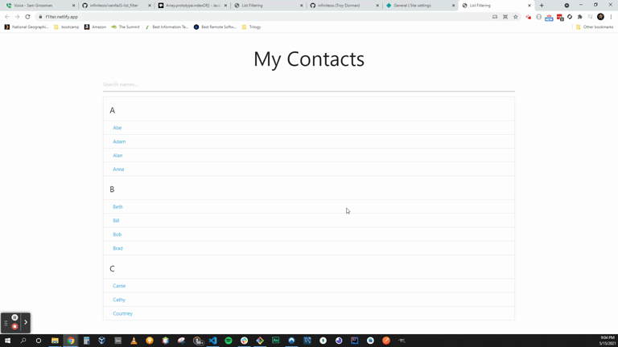

# VanillaJS - List Filtering 
### Real-time keyword search



Live Demo: 
https://f1lter.netlify.app/


### Built With

* Materialize CSS 
* Vanilla JavaScript
* HTML / CSS


### Relevant Code 

```
  // get value of input
        let filterValue = document
          .getElementById("filterInput")
          .value.toUpperCase();

        // get reference to names ul
        let ul = document.getElementById("names");

        // get li's from ul
        let li = ul.querySelectorAll("li.collection-item");
        

        // loop through collection-item li's
        for (let i = 0; i < li.length; i++) {
          let a = li[i].getElementsByTagName("a")[0];
          // if matched
          if (a.innerHTML.toUpperCase().indexOf(filterValue) > -1) {
            li[i].style.display = "";
          } else {
            li[i].style.display = "none";
          }
        }
      }
```

### Acknowledgement

Shouts out to DJ Brad Traversy for this dope, short tutorial.

